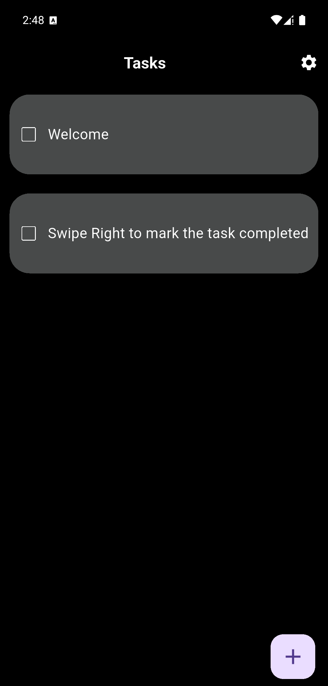
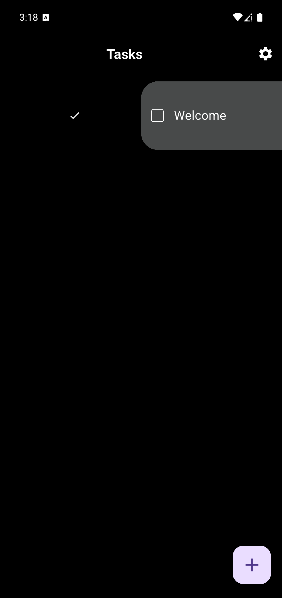

# My First Flutter To-Do App 📝

![App Screenshot 1 - Initial State] 

![App Screenshot 1 - Initial State]
_A sneak peek at the app when you first open it!_

Hey everyone! I'm really excited to share my first Flutter application. I built this project from scratch as a beginner. It’s a simple to-do list manager designed to help you keep track of your tasks without any extra fluff.

## Features That Go Hard 🔥

* **Welcome Onboarding:** New users receive a warm greeting with two default tasks ("Welcome" and "Swipe Right to mark the task completed") to help them get started. It's easy to pick up!

    ![App Screenshot 2 - Welcome Tasks]

    _Getting you started like a pro._

* **Effortless Task Completion:** Just **swipe right** on any task to mark it as completed.

    ![App Screenshot 3 - Swiping Right]

    _Swipe right to flex on your tasks!_

* **Smart Auto-Sorting:** Once a task is done, it automatically moves to the bottom of your list, keeping your incomplete tasks front and center. Your most important stuff stays at the top.

    ![App Screenshot 4 - Task Completed & Sorted]

    _Completed tasks chillin' at the bottom, letting incomplete tasks shine._

* **Intuitive Task Deletion:** Need to remove a task? Just **swipe left** and tap the delete icon. We added an extra tap to prevent those accidental deletes.

    ![App Screenshot 5 - Swiping Left to Delete]

    _Bye bye, task! 👋_

* **Seamless Task Creation:** Tap the `+` button in the corner to add a new task. The input field uses a **label instead of a hint text** so you always know what you're typing, even mid-thought. You can either `Cancel` or `Save` your new task – it’s up to you!

    ![App Screenshot 6 - Add New Task Popup]

    _Adding a new task with that slick label action._

* **Clear Empty State:** If you've completed all your tasks (or are just getting started!), the app gives you a friendly nudge: "No tasks, Create a task to get started." No confusing blank screens here!

    ![App Screenshot 7 - No Tasks State]
    
    _When your list is so clean, it's sparkling._

## Tech Stack 🛠️

* **Flutter:** For building this sleek, cross-platform mobile app.
* **Hive:** A lightweight and super fast key-value database used for efficient local data storage and management. Gotta keep that data secure and snappy!

## Getting Started (For the Devs 💻)

Wanna run this app locally? Here's how:

1.  **Clone the repo:**
    ```bash
    git clone [https://github.com/Bhavyasoni01/ToDoApp.git](https://github.com/Bhavyasoni01/ToDoApp)
    cd ToDoApp
    ```
2.  **Get Flutter dependencies:**
    ```bash
    flutter pub get
    ```
3.  **Run the app:**
    ```bash
    flutter run
    ```

## Future Plans (Stay Tuned! 👀)

This is just the beginning! I'm planning to add more features in the future, maybe some 🔥 theming options or even notifications. Let's see what happens!

